# Jenkins CI/CD Pipeline Setup

## Objeactive

To implement Continuous Integration and Delivery (CI/CD) using Jenkins by setting up an automated pipeline that builds, tests, and deploys Node.js applications from Git repositories,

### Prerequisites
- Jenkins server running
- Node.js project with Git repository
- Admin access to Jenkins

### Step 1: Install Jenkins Plugins
1. Go to **Manage Jenkins → Manage Plugins**
2. Install these plugins:
   - NodeJS Plugin
   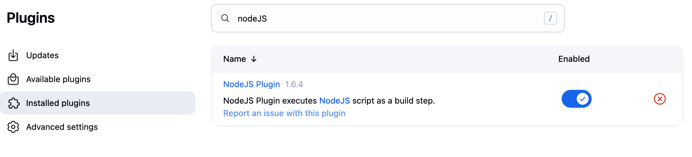
   - Git Plugin
   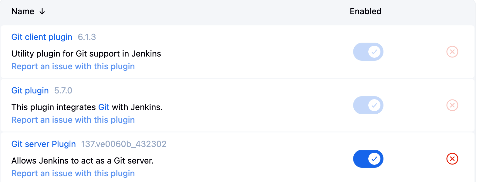
   - Pipeline Plugin
   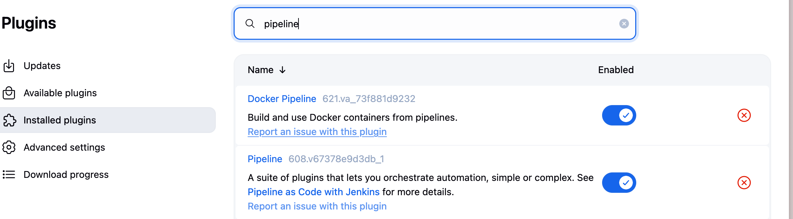
   - JUnit Plugin
   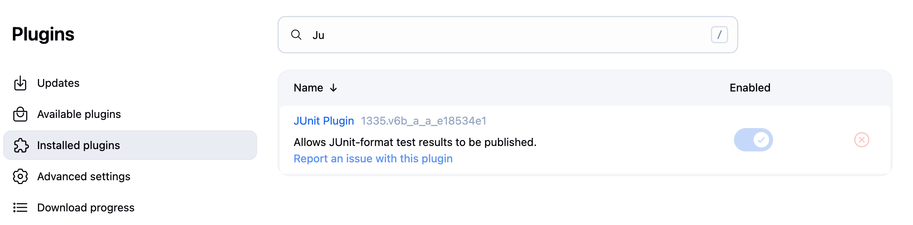

### Step 2: Configure Node.js
1. **Manage Jenkins → Global Tool Configuration**
2. Add NodeJS installation:

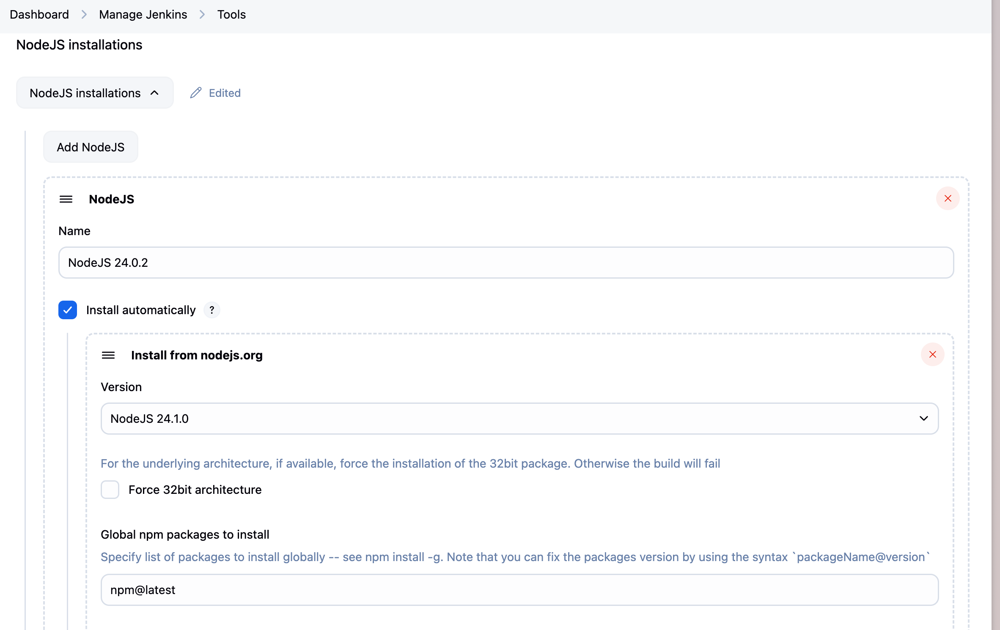

### Step 3: Create Jenkins Job
1. **New Item → Pipeline**
2. Configure:
   - Pipeline Definition: "Pipeline script from SCM"
   - SCM: Git
   - Repository URL: Git repo URL
   - Script Path: `Jenkinsfile`

### Step 4: Create Jenkinsfile
Created `Jenkinsfile` in project root:
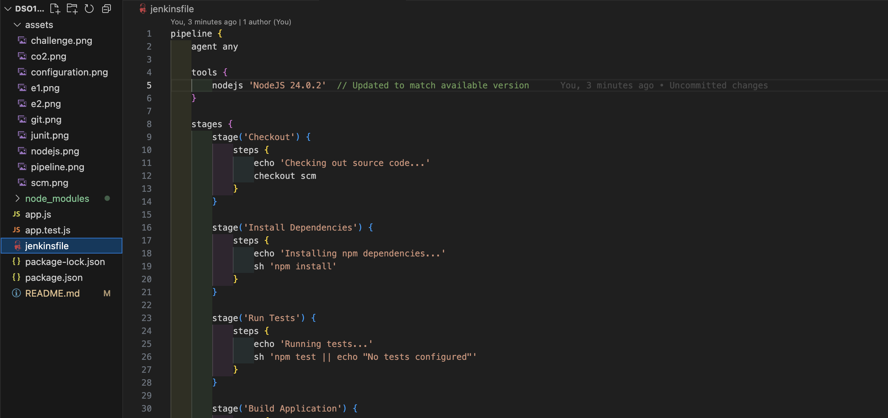

### Step 5: Configured Multi-Phase Pipeline: Jenkinsfile

Source Control: Git repository code fetching
Package Management: npm dependency setup
Quality Assurance: Automated test execution with coverage analysis
Compilation: Application assembly process
Storage: Build artifact preservation
Delivery: Staging environment deployment mock

### Step 6: Run Pipeline
1. Push Jenkinsfile to Git repo
2. Ran the pipeline.

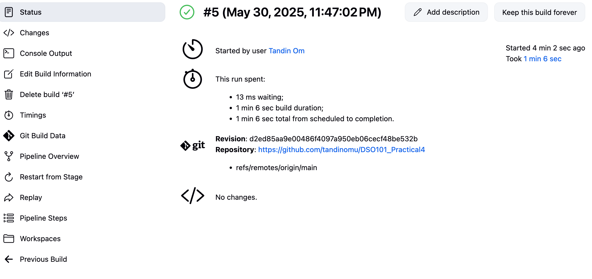

# Challenge: Troubleshooting

## Error 1: Node.js Tool Not Found
**Console Output:**

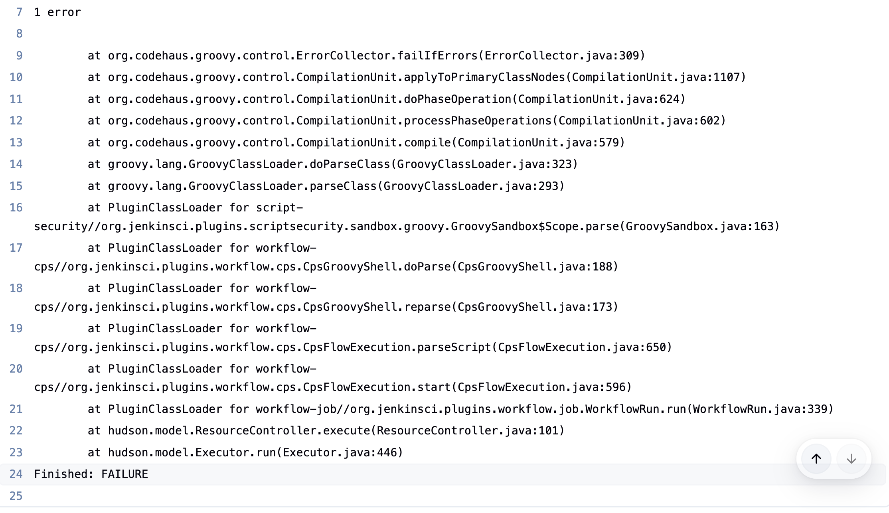

**Fixed the error.**

- Updated to the matched available version.

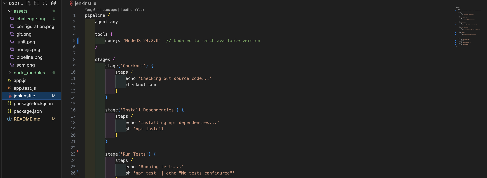

## Error 2: Script Path Issues

**Console Output:**
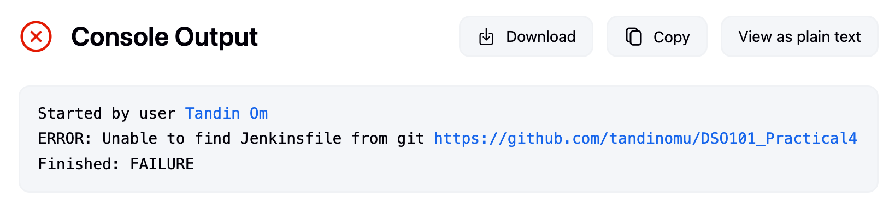

**Made changes in the pipeline script.**
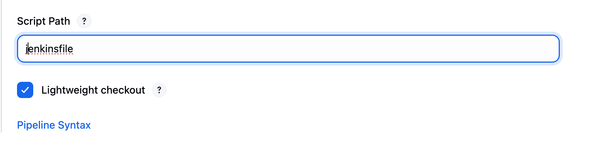

## Key Takeaways

Multi-Stage Pipeline: Built complete Jenkins pipeline with checkout, build, test, and deploy stages

Test Integration: Configured automated testing with coverage reports in Jenkins dashboard

Git Automation: Set up automatic builds triggered by code commits

Problem Solving: Learned to fix common Jenkins setup and configuration errors