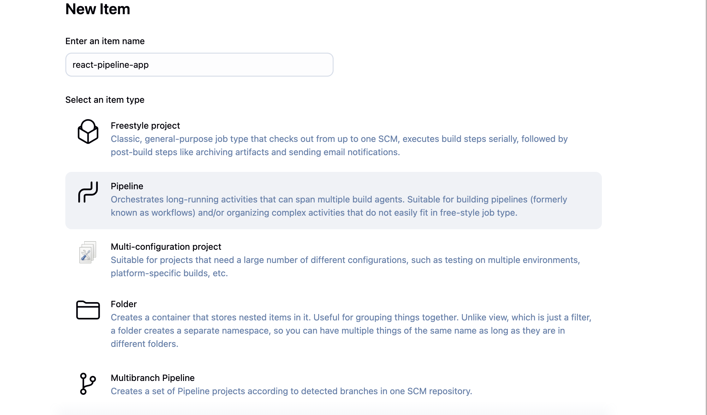

# DSO101_Practical5-6

# Jenkins Declarative Pipeline for React Application

A comprehensive CI/CD pipeline implementation using Jenkins Declarative Pipeline for a React application, featuring automated testing, Docker containerization, and deployment automation.

## Overview

This project demonstrates modern DevOps practices by implementing a complete CI/CD pipeline that:
- Automates the entire software delivery process from code commit to deployment
- Integrates testing, building, and containerization
- Provides secure credential management and deployment strategies
- Follows industry best practices for continuous integration and deployment

# Part 1: Guided Exercise

## Prerequisites

Jenkins server with Node.js and Git plugins installed
A Node.js project repository (e.g., Express.js, React, or NestJS app)
Basic familiarity with Jenkins and npm/yarn commands

### Jenkins Plugins Required
- NodeJS Plugin
- Docker Plugin
- Docker Pipeline Plugin
- Git Plugin
- Pipeline Plugin

## Installation & Setup

### Step 1: Environment Setup

#### 1. Create React Application

### Step 2: Jenkins Configuration

#### 1. Install Jenkins Plugins
1. Navigate to **Manage Jenkins** → **Manage Plugins** → **Available**
2. Install required plugins listed in prerequisites

#### 2. Configure Global Tools
1. Go to **Manage Jenkins** → **Global Tool Configuration**
2. Configure Node.js:
   - Name: `NodeJS 24.0.2`

   

#### 3. Created a New Pipeline Job

Under Pipeline, select:

Definition: Pipeline script from SCM
SCM: Git → Provided repository URL
Script Path: Jenkinsfile

#### 4. Define the Pipeline in Jenkinsfile

#### 5: Run Pipeline

### Part 2: Docker Setup(Challenge)

#### Step 1. Create Dockerfile

### Step 2: Docker Hub Integration

#### 1. Setup Docker Hub Credentials

Add credentials:
   - Kind: Username with password
   - ID: `dockerhub-credentials`

#### 2. Docker Build success

#### 3. Running the pipeline in jenkins 

#### 4. Images in dockerhub

### Challenges Faced 

1. Package Conflicts - Global TypeScript 5.8.3 vs project TypeScript 4.9.5 broke npm ci

Fix: Used npm install instead of npm ci in Dockerfile

2. Image vs Container - Built images but forgot to run containers (docker run)

Fix: Added docker run -d --name my-jenkins-app -p 3000:80 my-jenkins-pipeline-app:latest

3. Jenkins Gap - Pipeline missing Docker commands

Fix: Added Docker build, test, and deploy stages to Jenkinsfile

### Key Takeaways

Package Management: npm ci vs install, handling global conflicts.

DevOps Troubleshooting: Systematic debugging, reading error messages.

CI/CD Automation: Converting manual steps to Jenkins pipeline stages.

Registry Operations: Proper Docker Hub tagging and pushing.