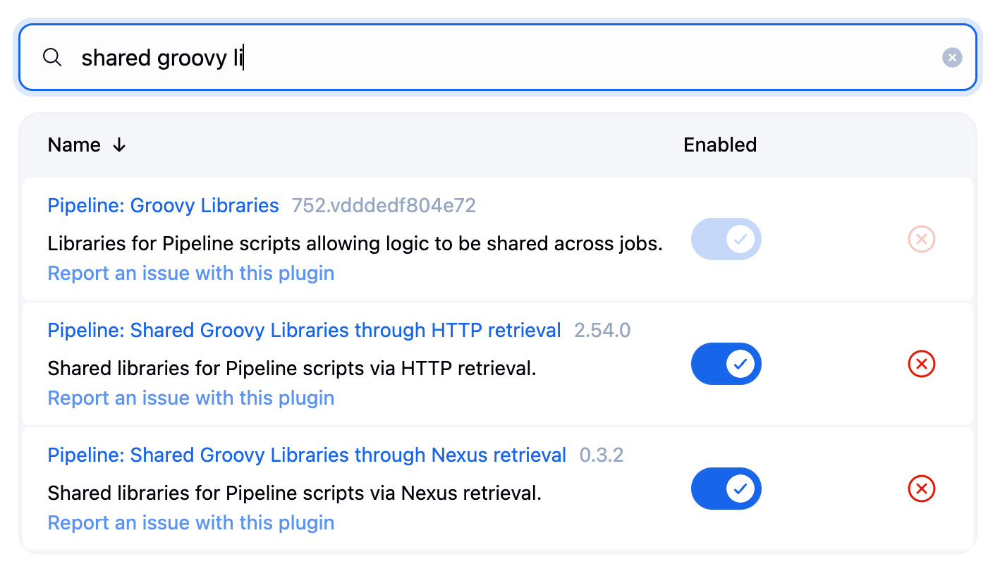
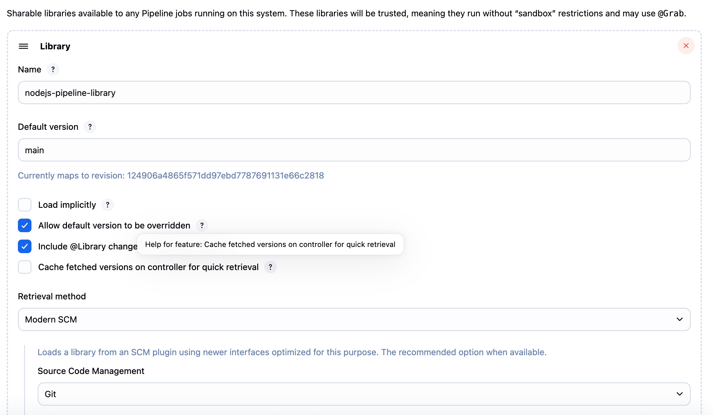
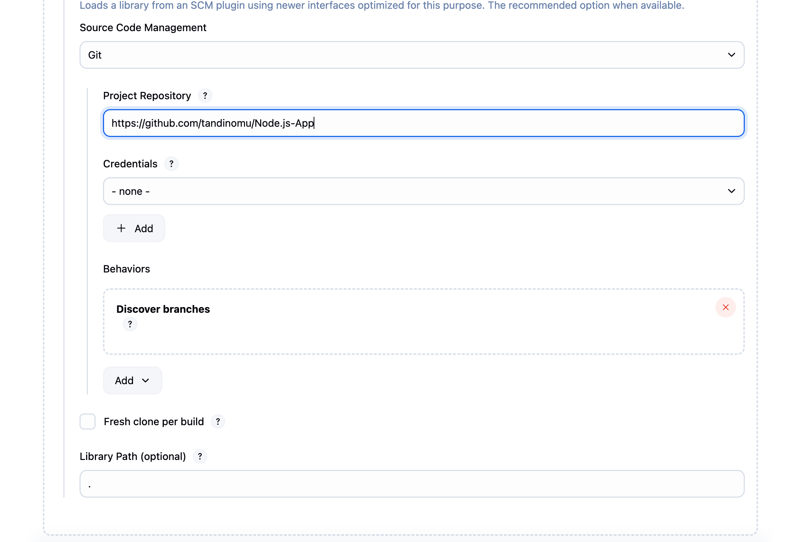
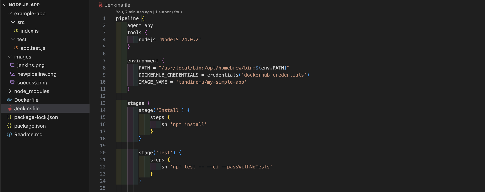
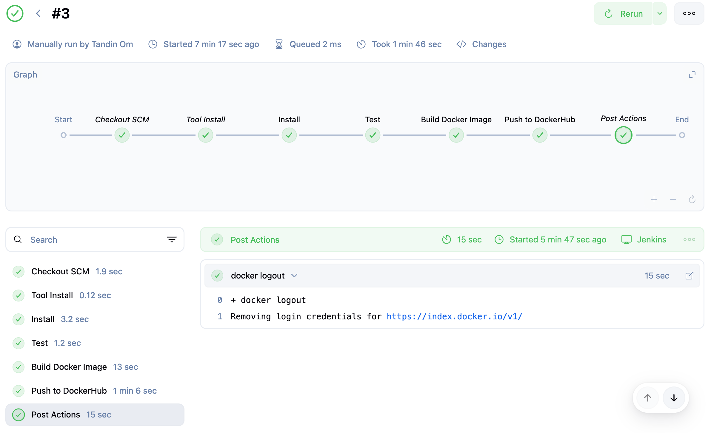
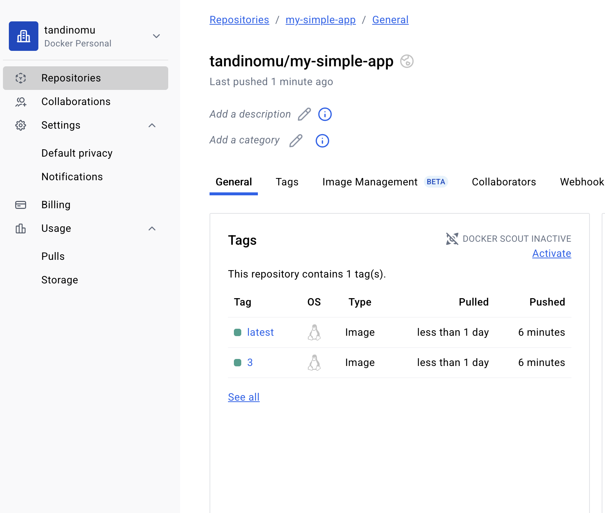

# DSO101_Practical7

# Node.js Jenkins Shared Library

## Objective

To demonstrates the implementation of a Jenkins Shared Library to standardize and streamline CI/CD processes for Node.js applications. The shared library provides reusable pipeline components that can be utilized across multiple projects, ensuring consistency and reducing code duplication.

## Project Structure

### 1. Shared Library Repository
**Repository:** [nodejs-pipeline-library](https://github.com/tandinomu/nodejs-pipeline-library)

### 2. Node.js Application Repository
**Repository:** [Node.js-App](https://github.com/tandinomu/Node.js-App)

## Implementation Process

### Phase 1: Shared Library Development

**1. Repository Creation and Structure**

Created the shared library repository with the standard Jenkins structure.

### Phase 2: Jenkins Configuration

**1. Plugin Installation**
- Verified **Pipeline: Shared Groovy Libraries** plugin installation


**2. Global Library Configuration**

Configured the shared library in Jenkins:
- **Path:** Manage Jenkins → Configure System → Global Pipeline Libraries
- **Settings:**



### Phase 3: Application Development


#### 1: Node.js Application Setup

**Created a new Node.js application:**

```bash
mkdir my-simple-app
cd my-simple-app
npm init -y
```

**Modified `package.json` to include start script:**

```json
{
  "name": "my-simple-app",
  "version": "1.0.0",
  "scripts": {
    "start": "node server.js"
  }
}
```

**Developed basic application file `server.js`:**

```javascript
console.log("Hello from Node.js Application!");
console.log("Server started successfully at:", new Date().toLocaleString());
```

### Step 2: Pipeline Configuration

**Created `Jenkinsfile` in the application root directory:**



## Build Execution Results

Ran the pipeline again in Jenkins

Expected Result:
- docker build -t tandinomu/my-simple-app:3 .
- Successfully built [image-id]
- docker login
- docker push tandinomu/my-simple-app:3
- docker push tandinomu/my-simple-app:latest



**Dockerhub Image**




## Challenges Faced

### 1. **Initial Pipeline Configuration**
- **Issue**: Jenkinsfile contained placeholder commands instead of actual build/deploy logic
- **Problem**: Pipeline only printed echo statements without performing real operations
- **Solution**: Replaced placeholder commands with proper Docker build and push stages

### 2. **Docker Command Not Found**
- **Issue**: `docker: command not found` error during pipeline execution
- **Root Cause**: Docker was installed but not available in Jenkins PATH
- **Impact**: Pipeline failed at Docker build stage
- **Diagnosis**: Docker located at `/usr/local/bin/docker` but Jenkins couldn't access it


### 3. **PATH Configuration for Jenkins**
- **Issue**: Jenkins environment didn't include Docker installation paths
- **Problem**: Jenkins PATH missing `/usr/local/bin` and `/opt/homebrew/bin`
- **Solution**: Updated Jenkinsfile environment variables:
  ```groovy
  environment {
      PATH = "/usr/local/bin:/opt/homebrew/bin:${env.PATH}"
  }
  ```

### 4. **Build Process Issues**
- **Issue**: Initial Jenkinsfile had no actual build steps for the application
- **Problem**: Missing Docker image creation and tagging logic
- **Challenge**: Integrating multi-stage build process (install → test → build → push)
- **Solution**: Implemented proper Docker build stages:
  ```groovy
  docker build -t ${IMAGE_NAME}:${BUILD_NUMBER} .
  docker tag ${IMAGE_NAME}:${BUILD_NUMBER} ${IMAGE_NAME}:latest
  ```

### 5. **Test Integration Challenges**
- **Issue**: Tests needed to run before Docker build to ensure code quality
- **Problem**: Pipeline continued even if tests failed in early versions
- **Solution**: Proper stage dependencies ensuring test success before build/deploy

### 6. **DockerHub Credentials Setup**

- **Challenge**: Configuring secure DockerHub authentication in Jenkins
- **Requirements**: Setting up username/password credentials for automated pushes
- **Solution**: Used Jenkins credential management with ID `dockerhub-credentials`

### 7. **Image Tagging and Versioning**
- **Issue**: No systematic approach to Docker image versioning
- **Challenge**: Managing both build-specific tags and latest tag
- **Solution**: Implemented dual tagging strategy:
  - Build number tag: `tandinomu/my-simple-app:${BUILD_NUMBER}`
  - Latest tag: `tandinomu/my-simple-app:latest`

## Key Learnings

- **Environment Setup**: Local Jenkins installations require proper PATH configuration for external tools
- **Docker Integration**: macOS Docker Desktop installation doesn't automatically expose Docker to all system processes
- **Credential Management**: Jenkins credentials provide secure way to handle authentication without exposing secrets
- **Pipeline Design**: Moving from echo statements to functional CI/CD requires proper stage implementation

## Summary

This practical implementation achieved:

* **Successful integration** of Jenkins Shared Libraries with Node.js applications
* **Code reusability** by utilizing centralized pipeline functions
* **Automated execution** of Node.js applications through Jenkins pipelines

Jenkins Shared Libraries provide an effective solution for standardizing CI/CD processes and eliminating redundant pipeline code across multiple projects.

## Repository Information

* **Application Repository:** [my-simple-app](https://github.com/tandinomu/Node.js-App)
* **Shared Library Repository:** [my-shared-lib](https://github.com/tandinomu/nodejs-pipeline-library)

