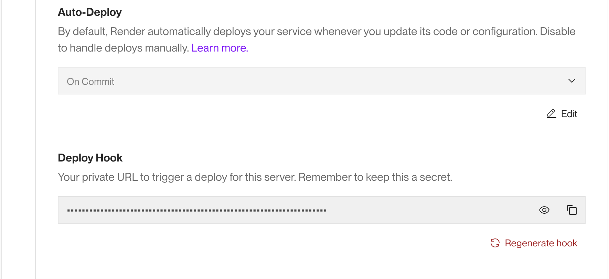

# DSO101_Practical8

# CI/CD Pipeline Implementation Steps

## Objective

The objective of this practical is to implement a complete Continuous Integration and Continuous Deployment (CI/CD) workflow that automates the build, test, and deployment process of a Node.js application using GitHub Actions, Docker, and Render.

## Steps Taken

### Step 1: Created Node.js Application

**Created the basic application structure:**
- `package.json` - Dependencies and npm scripts for Express.js server
- `server.js` - Express server with static file serving and health check endpoint
- `public/index.html` - Static webpage with modern CSS styling and interactive elements

### Step 2: Containerized with Docker

**Created Dockerfile with security best practices:**
- Used Node.js 18 Alpine base image for smaller footprint
- Multi-stage build process for optimization
- Created non-root user for security
- Implemented health check commands
- Exposed port 3000 for the application

**Created .dockerignore:**

### **Step 3: GitHub Actions Workflow**
- Created `.github/workflows/ci-cd.yml` file
- Configured 3-job pipeline structure:
  - Test Application
  - Build and Push Docker Image  
  - Trigger Render Deployment

### **Step 4: Repository Secrets Setup**
- Added `DOCKERHUB_USERNAME`: tandinomu
- Added `DOCKERHUB_TOKEN`: Access token for authentication

### **Step 6: Render Deployment Setup**
- Created Render web service

- Set up auto-deploy webhook integration

### **Step 7: Pipeline Testing**
- Pushed code to main branch
- Verified GitHub Actions execution

- Confirmed Docker image build and push

- Validated live deployment

## Challenges Faced

### 1. **Package Lock Inconsistency**
**Issue**: npm ci command failures in Docker builds  
**Error**: Missing or inconsistent package-lock.json  
**Solution**: Generated consistent package-lock.json with `npm install`

### 2. **GitHub Actions Not Triggering**
**Issue**: Pipeline not running automatically  
**Error**: No workflow executions on code push  
**Solution**: Ensured push to `main` branch and verified workflow file syntax

### 3. **Port Configuration Mismatch**
**Issue**: Application not accessible after deployment  
**Error**: Port binding conflicts  
**Solution**: Configured proper port mapping 

## Conclusion
This CI/CD implementation successfully demonstrates modern DevOps practices by automating the entire software delivery pipeline. The project achieved its primary objectives of establishing automated testing, containerization, and deployment workflows.
Key Achievements:

- Automated testing on every code commit
- Dockerized application with multi-platform support
- Seamless deployment to production environment
- Secure credential management implementation

The pipeline reduces deployment time from manual hours to automated minutes while ensuring code quality through automated testing. This foundation provides scalable infrastructure for future development and establishes best practices for continuous integration and deployment.