# Docker Compose Practical

## Introduction

This document summarizes my hands-on practice with Docker Compose to set up a simple Python web application with Redis as a backend service. The application is a basic web server built on Flask that counts page hits using Redis as a counter storage.

## Step 1: Project Setup

I created a new directory for the project and created the files which were required:

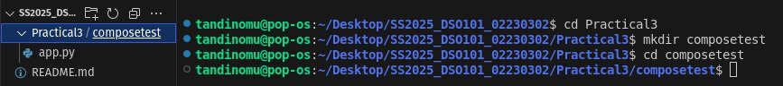

### Creating the Application Files

#### app.py
This file contains the Python Flask app code that it links to Redis:

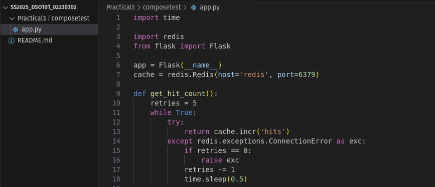

#### requirements.txt
This file states the Python dependencies:

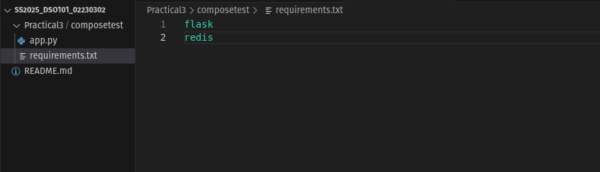

#### Dockerfile
This file contains build instructions for the web application Docker image:

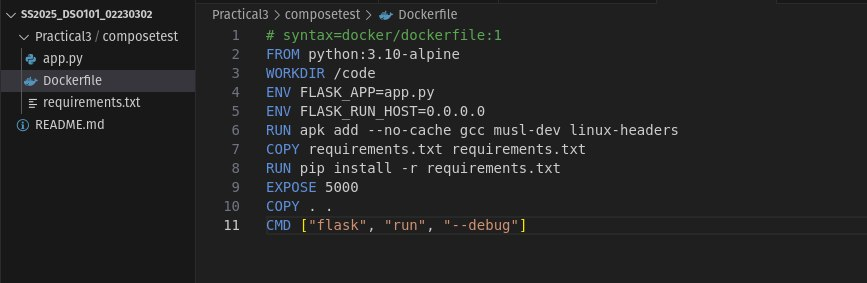

## Step 2: Compose File Creation

I also created a `compose.yaml` file to define the services:

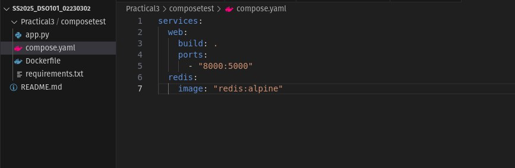

This Compose file states two services:
- `web`: It builds the Dockerfile in the current directory and maps host port 8000 to port 5000 inside the container
- `redis`: Uses the official Redis Alpine image on Docker Hub

## Step 3: Building and Running the Application

I launched the application using Docker Compose:

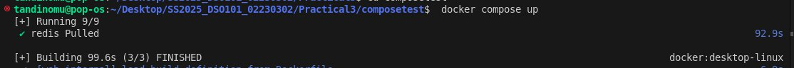

The command:
1. Created a default network for the services
2. Built the image for the web service
3. Started containers for both services
4. Printed logs from both services on the terminal

## Step 4: Testing the Application

I opened a web browser and navigated to http://localhost:8000/

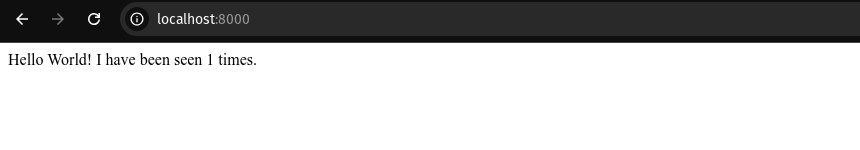


After refreshing the page:

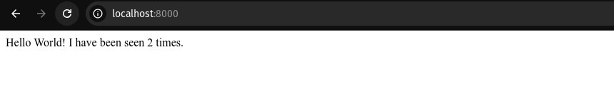

## Step 5: Checking Docker Images

I opened a new terminal and entered the following command to display the Docker images:

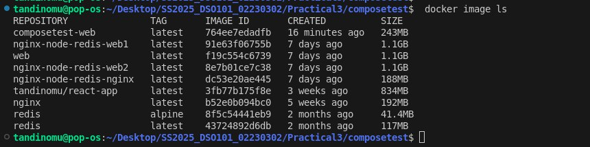

This proved the Docker Hub's Redis image and our web image made from the Dockerfile.

## Step 6: Setting Up Compose Watch

I updated the `compose.yaml` file to include Compose Watch for development:

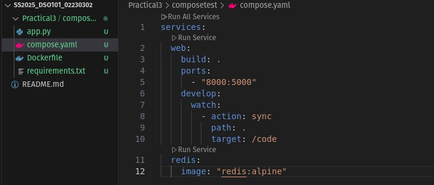

## Step 7: Updating the Application

I modified the greeting in the `app.py` file:

```python
@app.route('/')
def hello():
    count = get_hit_count()
    return f'Hello from Docker! I have been seen {count} times.\n'
```

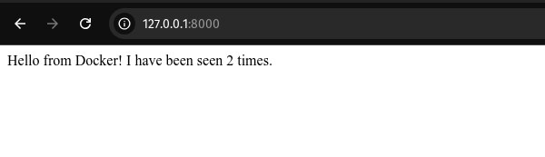

## Step 8: Splitting Services with Multiple Compose Files

I included a new file `infra.yaml` for the Redis service:

And modified the primary `compose.yaml` file to point to it:

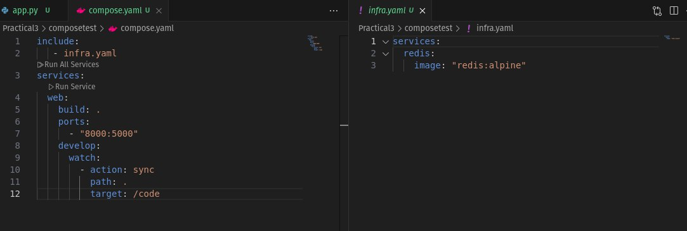

## Step 9: Running in Detached Mode

I ran the application in detached mode:

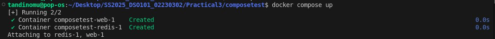

And checked the running services:

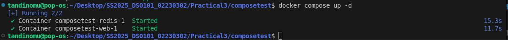

## Conclusion

This practical demonstrated:
1. Creating a multi-container application with Docker Compose
2. Connecting a Flask application to Redis
3. Utilizing Compose Watch for development
4. Working with multiple Compose files
5. Container management in detached mode

Docker Compose significantly facilitated the process of running a multi-container application, handling inter-container networking, and handling the development workflow.