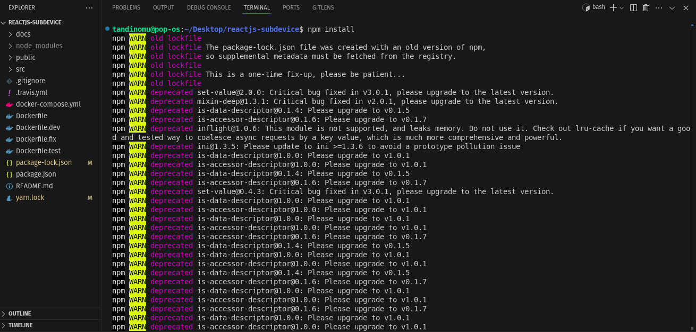
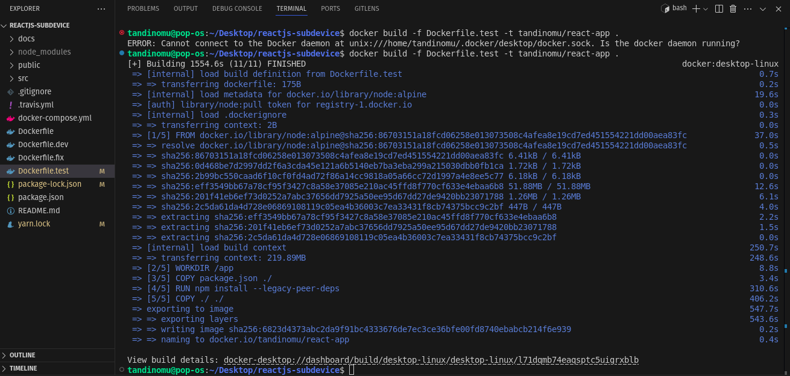
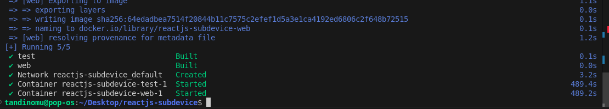
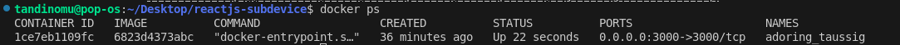
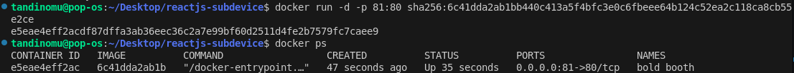
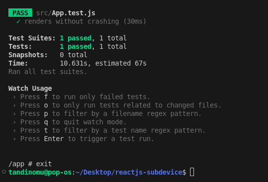
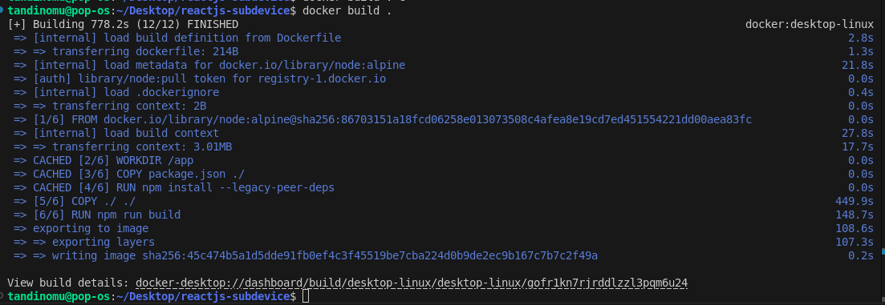
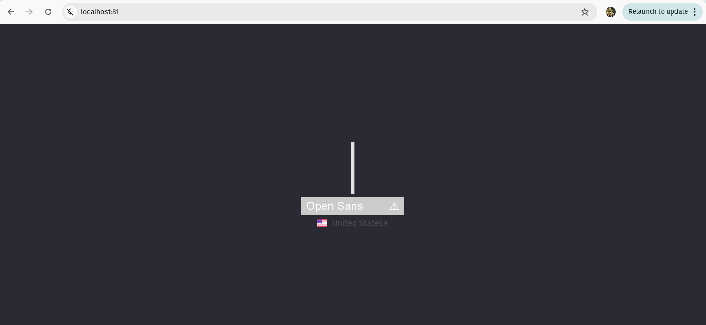

# Practical Report: Docker Containerization for React.js Application

## Introduction

Docker is an open source software platform used to create, deploy and manage virtualized application containers on a common operating system (OS), with an ecosystem of allied tools. 

## Containerization

This is the process of packaging an application and its dependencies (libraries, runtime, system tools, etc.) into a single, self-contained unit called a container. 

## Steps Followed for Docker Containerization Exercise

### 1. Installing Dependencies




The terminal output shows several deprecated packages and warnings related to package versions, which is typical during npm installations. 

### 2. Docker Build Process

The Docker build process was executed with:




### 3. Running Docker Containers

After successful build, containers were launched with:

```bash
docker run -d -p 3000:3000 tandinomu/react-app
```



And later:

```bash
docker run -d -p 81:80 sha256:6c41dda2ab1bb448c413a5f4bfc3e0c6fbeee64b124c52ea2c118ca8cb55e2ce
```


This maps port 81 on the host to port 80 in the container.

### 4. Checking Container Status

To verify running containers, the command was used:

```bash
docker ps
```


The output shows three containers running:
- A container with ID starting with 1c7ceb10efc (tandinomu/react-app)
- A container with ID starting with e0631ff83c75 (reactjs-subdevice-web)
- A container with ID starting with 6abfd67c6d52 (reactjs-subdevice-test)

All containers were successfully running with port mapping 3000:3000/tcp for the first two and a unique name for each container.


### 5. Running Tests

The application has test capability, with a test suite that successfully passed:




### 6. Dockerfile for Production

A multi-stage Dockerfile was created to optimize the production build. The screenshot below represents this process, with a successful build producing a container that was then run with port 81 mapped to container port 80.


 
### 7. Verify Running Container
Access the application in the browser:

```bash
http://localhost:8082
```


## Conclusion

The Docker containerization of the React.js application was successfully completed. The installation of dependencies, building Docker images, and running multiple containers with appropriate port mappings (3000:3000 for development and 81:80 for production) were successful. The multi-stage Dockerfile optimized the production build by reducing image size. All containers ran correctly, and the application's test suite passed, confirming that functionality was preserved during containerization. This exercise demonstrated Docker's effectiveness in creating consistent, portable environments for web application deployment.